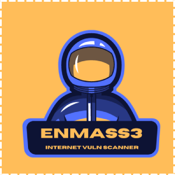

# EnMass3

<p align="center">
    
</p>

EnMass3 is a port scanner that utilizes the functionality of both [masscan](https://github.com/robertdavidgraham/masscan) and [nrich](https://gitlab.com/shodan-public/nrich). The tool was built with the mindset of scanning the internet to find vulnerable endpoints, but **FOR THE ENTIRE INTERNET**.

EnMass3 will take an input file with CDIR notation, scan the IP ranges for the top 20 common vulnerable ports.  Once IP and ports are found, the information is parsed
to nrich and the new EnMass3 output file will contain IP, Ports, Tags, and Vulnerabilities of each vulnerable asset found.  Output is currently available in SHELL (aka text) and JSON formats.

**Please Note:** Port scanning is in the **grey area**, you should scan **ONLY** if you have permission from the apprioriate organization.

The [AntiScanIPList.txt](./files/AntiScanIPList.txt) is a list which includes IP ranges. These IPs will be excluded for the safety of the users. This list does not offer all IPs to be blacklisted, the user can add additional IPs if they so choose.

_Use at your own risk. Please read the Disclaimer._

## Dependencies

- Nrich
- Masscan
- jq

_If you do not have these tools installed, EnMass3 will install them._

## Installation

```shell
git clone https://github.com/zer0uid/EnMass3.git
chmod +x enmass3.sh
```

## Usage

`sudo ./enmass3.sh [Input File]`

Create file with CIDR notations, see below for example:

```ascii
192.168.0.0/16
192.168.1.0/24
172.16.0.0/16
172.16.1.0/24
```
2. `sudo ./enmass3.sh [Input File]`
3. Review `EnMass3_output.txt & EnMass3_output.json` files for vulnerable targets.

**IMPORTANT:** Use a VPN to avoid the possibility of getting your IP banned from your local ISP.

_Be sure to use a VPN to avoid the possibility of getting banned from your ISP._

## Disclaimer

EnMass3 is supposed to be used in a **legal** manner. We are not responsible for the actions the user takes while using this tool. [Please use responsibly](./files/ethics_and_legality_of_port_scanning.md).

If you scan an IP range numerous times, you have the possibility of getting banned from your ISP. It is important to use a VPN while using EnMass3.

## Contributors

- [Republic of Hackers](https://discord.com/invite/repofhackers)
- [zer0uid](https://github.com/zer0uid)
- [Abr4Xa5](https://github.com/AbraXa5)
- [10splayaSec](https://github.com/10splayaSec)
- [kod3r](https://github.com/abhay-khattar)
